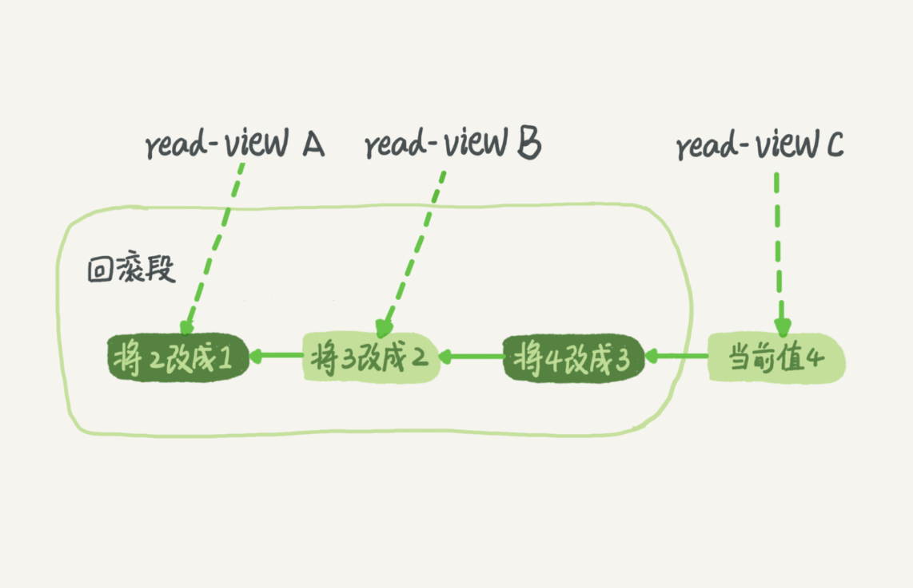

# 03 讲事务隔离：为什么你改了我还看不见

提到事务，你肯定不陌生，和数据库打交道的时候，我们总是会用到事务。最经典的例子就是转账，你要给朋友小王转 100 块钱，而此时你的银行卡只有 100 块钱。

转账过程具体到程序里会有一系列的操作，比如查询余额、做加减法、更新余额等，这些操作必须保证是一体的，不然等程序查完之后，还没做减法之前，你这 100 块钱，完全可以借着这个时间差再查一次，然后再给另外一个朋友转账，如果银行这么整，不就乱了么？这时就要用到“事务”这个概念了。

简单来说，事务就是要保证一组数据库操作，要么全部成功，要么全部失败。在 MySQL 中，事务支持是在引擎层实现的。你现在知道，MySQL 是一个支持多引擎的系统，但并不是所有的引擎都支持事务。比如 MySQL 原生的 MyISAM 引擎就不支持事务，这也是 MyISAM 被 InnoDB 取代的重要原因之一。

今天的文章里，我将会以 InnoDB 为例，剖析 MySQL 在事务支持方面的特定实现，并基于原理给出相应的实践建议，希望这些案例能加深你对 MySQL 事务原理的理解。

# 隔离性与隔离级别

提到事务，你肯定会想到 ACID（Atomicity、Consistency、Isolation、Durability，即原子性、一致性、隔离性、持久性），今天我们就来说说其中 I，也就是“隔离性”。

当数据库上有多个事务同时执行的时候，就可能出现脏读（dirty read）、不可重复读（non-repeatable read）、幻读（phantom read）的问题，为了解决这些问题，就有了“隔离级别”的概念。

在谈隔离级别之前，你首先要知道，你隔离得越严实，效率就会越低。因此很多时候，我们都要在二者之间寻找一个平衡点。SQL 标准的事务隔离级别包括：读未提交（read uncommitted）、读提交（read committed）、可重复读（repeatable read）和串行化（serializable ）。下面我逐一为你解释：

- 读未提交是指，一个事务还没提交时，它做的变更就能被别的事务看到。
- 读提交是指，一个事务提交之后，它做的变更才会被其他事务看到。
- 可重复读是指，一个事务执行过程中看到的数据，总是跟这个事务在启动时看到的数据是一致的。当然在可重复读隔离级别下，未提交变更对其他事务也是不可见的。
- 串行化，顾名思义是对于同一行记录，“写”会加“写锁”，“读”会加“读锁”。当出现读写锁冲突的时候，后访问的事务必须等前一个事务执行完成，才能继续执行。

其中“读提交”和“可重复读”比较难理解，所以我用一个例子说明这几种隔离级别。假设数据表 T 中只有一列，其中一行的值为 1，下面是按照时间顺序执行两个事务的行为。

    mysql> create table T(c int) engine=InnoDB;
    insert into T(c) values(1);

  
我们来看看在不同的隔离级别下，事务 A 会有哪些不同的返回结果，也就是图里面 V1、V2、V3 的返回值分别是什么。

- 若隔离级别是“读未提交”， 则 V1 的值就是 2。这时候事务 B 虽然还没有提交，但是结果已经被 A 看到了。因此，V2、V3 也都是 2。
- 若隔离级别是“读提交”，则 V1 是 1，V2 的值是 2。事务 B 的更新在提交后才能被 A 看到。所以， V3 的值也是 2。
- 若隔离级别是“可重复读”，则 V1、V2 是 1，V3 是 2。之所以 V2 还是 1，遵循的就是这个要求：事务在执行期间看到的数据前后必须是一致的。
- 若隔离级别是“串行化”，则在事务 B 执行“将 1 改成 2”的时候，会被锁住。直到事务 A 提交后，事务 B 才可以继续执行。所以从 A 的角度看， V1、V2 值是 1，V3 的值是 2。

在实现上，数据库里面会创建一个视图，访问的时候以视图的逻辑结果为准。在“可重复读”隔离级别下，这个视图是在事务启动时创建的，整个事务存在期间都用这个视图。在“读提交”隔离级别下，这个视图是在每个 SQL 语句开始执行的时候创建的。这里需要注意的是，“读未提交”隔离级别下直接返回记录上的最新值，没有视图概念；而“串行化”隔离级别下直接用加锁的方式来避免并行访问。

我们可以看到在不同的隔离级别下，数据库行为是有所不同的。Oracle 数据库的默认隔离级别其实就是“读提交”，因此对于一些从 Oracle 迁移到 MySQL 的应用，为保证数据库隔离级别的一致，你一定要记得将 MySQL 的隔离级别设置为“读提交”。

配置的方式是，将启动参数 transaction-isolation 的值设置成 READ-COMMITTED。你可以用 show variables 来查看当前的值。

    mysql> show variables like 'transaction_isolation';

    +-----------------------+----------------+

    | Variable_name | Value |

    +-----------------------+----------------+

    | transaction_isolation | READ-COMMITTED |

    +-----------------------+----------------+

总结来说，存在即合理，哪个隔离级别都有它自己的使用场景，你要根据自己的业务情况来定。我想**你可能会问那什么时候需要“可重复读”的场景呢**？我们来看一个数据校对逻辑的案例。

假设你在管理一个个人银行账户表。一个表存了每个月月底的余额，一个表存了账单明细。这时候你要做数据校对，也就是判断上个月的余额和当前余额的差额，是否与本月的账单明细一致。你一定希望在校对过程中，即使有用户发生了一笔新的交易，也不影响你的校对结果。

这时候使用“可重复读”隔离级别就很方便。事务启动时的视图可以认为是静态的，不受其他事务更新的影响。

# 事务隔离的实现

理解了事务的隔离级别，我们再来看看事务隔离具体是怎么实现的。这里我们展开说明“可重复读”。

在 MySQL 中，实际上每条记录在更新的时候都会同时记录一条回滚操作。记录上的最新值，通过回滚操作，都可以得到前一个状态的值。

假设一个值从 1 被按顺序改成了 2、3、4，在回滚日志里面就会有类似下面的记录。

  
当前值是 4，但是在查询这条记录的时候，不同时刻启动的事务会有不同的 read-view。如图中看到的，在视图 A、B、C 里面，这一个记录的值分别是 1、2、4，同一条记录在系统中可以存在多个版本，就是数据库的多版本并发控制（MVCC）。对于 read-view A，要得到 1，就必须将当前值依次执行图中所有的回滚操作得到。

同时你会发现，即使现在有另外一个事务正在将 4 改成 5，这个事务跟 read-view A、B、C 对应的事务是不会冲突的。

你一定会问，回滚日志总不能一直保留吧，什么时候删除呢？答案是，在不需要的时候才删除。也就是说，系统会判断，当没有事务再需要用到这些回滚日志时，回滚日志会被删除。

什么时候才不需要了呢？就是当系统里没有比这个回滚日志更早的 read-view 的时候。

基于上面的说明，我们来讨论一下为什么建议你尽量不要使用长事务。

长事务意味着系统里面会存在很老的事务视图。由于这些事务随时可能访问数据库里面的任何数据，所以这个事务提交之前，数据库里面它可能用到的回滚记录都必须保留，这就会导致大量占用存储空间。

在 MySQL 5.5 及以前的版本，回滚日志是跟数据字典一起放在 ibdata 文件里的，即使长事务最终提交，回滚段被清理，文件也不会变小。我见过数据只有 20GB，而回滚段有 200GB 的库。最终只好为了清理回滚段，重建整个库。

除了对回滚段的影响，长事务还占用锁资源，也可能拖垮整个库，这个我们会在后面讲锁的时候展开。

# 事务的启动方式

如前面所述，长事务有这些潜在风险，我当然是建议你尽量避免。其实很多时候业务开发同学并不是有意使用长事务，通常是由于误用所致。MySQL 的事务启动方式有以下几种：

1.  显式启动事务语句， begin 或 start transaction。配套的提交语句是 commit，回滚语句是 rollback。

2.  set autocommit=0，这个命令会将这个线程的自动提交关掉。意味着如果你只执行一个 select 语句，这个事务就启动了，而且并不会自动提交。这个事务持续存在直到你主动执行 commit 或 rollback 语句，或者断开连接。

有些客户端连接框架会默认连接成功后先执行一个 set autocommit=0 的命令。这就导致接下来的查询都在事务中，如果是长连接，就导致了意外的长事务。

因此，我会建议你总是使用 set autocommit=1, 通过显式语句的方式来启动事务。

但是有的开发同学会纠结“多一次交互”的问题。对于一个需要频繁使用事务的业务，第二种方式每个事务在开始时都不需要主动执行一次 “begin”，减少了语句的交互次数。如果你也有这个顾虑，我建议你使用 commit work and chain 语法。

在 autocommit 为 1 的情况下，用 begin 显式启动的事务，如果执行 commit 则提交事务。如果执行 commit work and chain，则是提交事务并自动启动下一个事务，这样也省去了再次执行 begin 语句的开销。同时带来的好处是从程序开发的角度明确地知道每个语句是否处于事务中。

你可以在 information_schema 库的 innodb_trx 这个表中查询长事务，比如下面这个语句，用于查找持续时间超过 60s 的事务。

    select * from information_schema.innodb_trx where TIME_TO_SEC(timediff(now(),trx_started))>60

# 小结

这篇文章里面，我介绍了 MySQL 的事务隔离级别的现象和实现，根据实现原理分析了长事务存在的风险，以及如何用正确的方式避免长事务。希望我举的例子能够帮助你理解事务，并更好地使用 MySQL 的事务特性。

我给你留一个问题吧。你现在知道了系统里面应该避免长事务，如果你是业务开发负责人同时也是数据库负责人，你会有什么方案来避免出现或者处理这种情况呢？

你可以把你的思考和观点写在留言区里，我会在下一篇文章的末尾和你讨论这个问题。感谢你的收听，也欢迎你把这篇文章分享给更多的朋友一起阅读。

# 上期问题时间

在上期文章的最后，我给你留下的问题是一天一备跟一周一备的对比。

好处是“最长恢复时间”更短。

在一天一备的模式里，最坏情况下需要应用一天的 binlog。比如，你每天 0 点做一次全量备份，而要恢复出一个到昨天晚上 23 点的备份。

一周一备最坏情况就要应用一周的 binlog 了。

系统的对应指标就是 @尼古拉斯·赵四 @慕塔 提到的 RTO（恢复目标时间）。

当然这个是有成本的，因为更频繁全量备份需要消耗更多存储空间，所以这个 RTO 是成本换来的，就需要你根据业务重要性来评估了。

同时也感谢 @super blue cat、@高枕、@Jason 留下了高质量的评论。

## 精选留言

- 

  壹笙漂泊

  1、务的特性：原子性、一致性、隔离性、持久性  
  2、多事务同时执行的时候，可能会出现的问题：脏读、不可重复读、幻读  
  3、事务隔离级别：读未提交、读提交、可重复读、串行化  
  4、不同事务隔离级别的区别：  
  读未提交：一个事务还未提交，它所做的变更就可以被别的事务看到  
  读提交：一个事务提交之后，它所做的变更才可以被别的事务看到  
  可重复读：一个事务执行过程中看到的数据是一致的。未提交的更改对其他事务是不可见的  
  串行化：对应一个记录会加读写锁，出现冲突的时候，后访问的事务必须等前一个事务执行完成才能继续执行  
  5、配置方法：启动参数 transaction-isolation  
  6、事务隔离的实现：每条记录在更新的时候都会同时记录一条回滚操作。同一条记录在系统中可以存在多个版本，这就是数据库的多版本并发控制（MVCC）。  
  7、回滚日志什么时候删除？系统会判断当没有事务需要用到这些回滚日志的时候，回滚日志会被删除。  
  8、什么时候不需要了？当系统里么有比这个回滚日志更早的 read-view 的时候。  
  9、为什么尽量不要使用长事务。长事务意味着系统里面会存在很老的事务视图，在这个事务提交之前，回滚记录都要保留，这会导致大量占用存储空间。除此之外，长事务还占用锁资源，可能会拖垮库。  
  10、事务启动方式：一、显式启动事务语句，begin 或者 start transaction,提交 commit，回滚 rollback；二、set autocommit=0，该命令会把这个线程的自动提交关掉。这样只要执行一个 select 语句，事务就启动，并不会自动提交，直到主动执行 commit 或 rollback 或断开连接。  
  11、建议使用方法一，如果考虑多一次交互问题，可以使用 commit work and chain 语法。在 autocommit=1 的情况下用 begin 显式启动事务，如果执行 commit 则提交事务。如果执行 commit work and chain 则提交事务并自动启动下一个事务。

  思考题：

  在开发过程中，尽可能的减小事务范围，少用长事务，如果无法避免，保证逻辑日志空间足够用，并且支持动态日志空间增长。监控 Innodb_trx 表，发现长事务报警。

  疑问：

  关于第二节的思考题，读题干的意思，是在什么场景下，一天一备比一周一备更有优势。老师的答案只是给出了一天一备的优势，那么适用场景怎么理解呢？

  2018-11-19 13:58

  作者回复

  总结得非常好

  第二讲问题，其实备份是强需求，至于多少合适，还是得平衡业务需求和存储成本

  2018-11-19 15:08

- 

  斯坦福

  预告：林晓斌老师将做客极客 Live，分享他 MySQL 的心路历程  
  前阿里丁奇：我的 MySQL 心路历程  
  11 月 21 日（周三） 20:30-21:30

  本次直播，林晓斌将畅谈个人成长经历，分享自己是如何从数据库小白逐步成长为 MySQL 内核开发人员的。从业十几年，他经历了哪些比较重要的事儿？他觉得什么事儿最有难度？什么事儿最有成就感？他是怎样应对的？  
  1、MySQL 数据库的最佳学习路径  
  2、丁奇遇到过哪些挑战？走过那些坑？是如何应对的？  
  3、从业十几年来，关于数据库性能的“奇闻异事”

  加小助手微信：geektime001 或 geektime004（二选一），获取直播最新消息

  2018-11-19 13:52

- 

  京京 beaver

  mysql> show variables like 'transaction_isolation';  
  这句写错了，应该是 tx_isolation。测试了一下

  2018-12-28 15:34

  作者回复

  你是不是用的 5.6 或更早的版本

  5.7 引入了 transaction_isolation 用来替换 tx_isolation 了，到 8.0.3 就去掉了后者了

  2018-12-28 15:59

- 

  LAMBO

  读未提交：别人改数据的事务尚未提交，我在我的事务中也能读到。  
  读已提交：别人改数据的事务已经提交，我在我的事务中才能读到。  
  可重复读：别人改数据的事务已经提交，我在我的事务中也不去读。  
  串行：我的事务尚未提交，别人就别想改数据。  
  这 4 种隔离级别，并行性能依次降低，安全性依次提高。

  2018-11-20 20:21

  作者回复

  总结的好

  2018-11-20 21:08

- 

  WL

  为该讲总结了几个问题, 大家复习的时候可以先尝试回答这些问题检查自己的掌握程度:

  1.

  事务的概念是什么?

  2.

  mysql 的事务隔离级别读未提交, 读已提交, 可重复读, 串行各是什么意思?

  3.

  读已提交, 可重复读是怎么通过视图构建实现的?

  4.

  可重复读的使用场景举例? 对账的时候应该很有用?

  5.

  事务隔离是怎么通过 read-view(读视图)实现的?

  6.

  并发版本控制(MCVV)的概念是什么, 是怎么实现的?

  7.

  使用长事务的弊病? 为什么使用常事务可能拖垮整个库?

  8.

  事务的启动方式有哪几种?

  9.

  commit work and chain 的语法是做什么用的?

  10.

  怎么查询各个表中的长事务?

  11.

  如何避免长事务的出现?

  2018-11-24 15:12

  作者回复

  谢谢。我在微博上会截图优质评论，你的总结会经常“上榜”哈。如果有不合适你跟我说下，我去删掉

  2018-11-24 15:24

- 

  lfn

  事务隔离的实现似乎有点太简略，没跟上林老师的思路。。

  2018-11-19 01:11

  作者回复

  对于 RR，你可以这么想，每个事务启动的时候打一个快照，别人改的“我不听我不听”

  2018-11-19 10:20

- 

  果然如此

  作业：设置 autocommit=1，另外，编写一个定时监控 Innodb_trx 表中时间比较大的事务的任务，如果发现长事务，随时自动发邮件提醒开发人员。

  2018-11-19 08:55

- 

  滩涂曳尾

  在“读提交”隔离级别下，这个视图是在每个 SQL 语句开始执行的时候创建的。老师，这句话怎么理解呢

  2018-11-20 08:08

- 

  \* 晓 \*

  老师，MySQL 中 undo 的内容会被记录到 redo 中吗？比如一个事务在执行到一半的时候实例崩溃了，在恢复的时候是不是先恢复 redo，再根据 redo 构造 undo 回滚宕机前没有提交的事务呢？

  2018-11-20 08:32

  作者回复

  对的，是你说的这个流程

  2018-11-20 09:54

- 

  ThinkingQuest

  感谢老师的高质量文章。

  试图的实现，多个回滚段那一块，不是很好理解。

  2018-11-19 09:33

- Gavin

  下面是我的自问自答，也是我的学习笔记，问下斌哥，这样理解准确吗？  
  在可重复读的隔离级别下，如何理解**当系统里没有比这个回滚日志更早的 read-view 的时候**，这个回滚日志就会被删除？

  这也是**尽量不要使用长事务**的主要原因。

  比如，在某个时刻（今天上午 9:00）开启了一个事务 A（对于可重复读隔离级别，此时一个视图 read-view A 也创建了），这是一个很长的事务……

  事务 A 在今天上午 9:20 的时候，查询了一个记录 R1 的一个字段 f1 的值为 1……

  今天上午 9:25 的时候，一个事务 B（随之而来的 read-view B）也被开启了，它更新了 R1.f1 的值为 2（同时也创建了一个由 2 到 1 的回滚日志），这是一个短事务，事务随后就被 commit 了。

  今天上午 9:30 的时候，一个事务 C（随之而来的 read-view C）也被开启了，它更新了 R1.f1 的值为 3（同时也创建了一个由 3 到 2 的回滚日志），这是一个短事务，事务随后就被 commit 了。

  ……

  到了下午 3:00 了，长事务 A 还没有 commit，为了保证事务在执行期间看到的数据在前后必须是一致的，那些老的事务视图、回滚日志就必须存在了，这就占用了大量的存储空间。

  源于此，我们应该尽量不要使用长事务。

  2018-12-04 09:55

  作者回复

  非常好

  2018-12-04 10:19

- 

  LY

  老师 同一个事务中的插入/更新/删除->查询，这种情况呢

  2018-11-19 08:53

  作者回复

  那自己改了肯定得看到呀，不然程序逻辑崩溃了

  2018-11-19 09:47

- 

  梁中华

  感觉没讲透，最好结合锁一起讲才能彻底讲清楚，比如两个 RR 级的事务同时启动，都是对同一个字段操作，系统起了两个互不影响的 view,那事务的结果会不会被覆盖，直觉上肯定不会被覆盖，大家知道记录上会有锁，但这个锁和 view 是什么关系呢？建议 mvcc 可以展开来讲讲。

  2018-11-19 12:46

  作者回复

  涉及到更新是是涉及行锁，在第七讲会讲到。

  2018-11-19 14:24

- 

  兔斯基

  是不是可以理解为  
  读提交不能保证一个事务中对同一条数据的每次读取都一致。  
  可重复读可以保证在一个事务性，每次读取同一条记录，值是不会发生改变的。

  2018-11-19 08:00

- 

  lionetes

  mvcc 是有 undo 实现的，undo 又是有 redo 引起生成，默认事务是 rr，但还是建议 rc ，这节篇幅有点短 哈哈 看不够

  2018-11-19 00:27

- 

  王凯

  autocommit 设置为 1，用文中提到的检查长事务的方法做每秒的计划任务检查，检查到的话记录并杀死进程。

  另外，设置 SET GLOBAL MAX_EXECUTION_TIME=3000. 确保单条语句执行时间在规定的范围之内。

  2018-11-19 10:25

  作者回复

  不过 global 设下去恐怕担心如果真有需要执行久的，（比如备份），会不会被误伤

  可以考虑设置成 session 内有效，让业务代码主动去做？

  2018-11-19 10:45

- 

  郭月华

  python 里面，autocommit 默认是 0 的，这种情况下，一条 select 语句如果不写 begin，是否需要，commit?

  2018-11-19 07:51

  作者回复

  不 commit 如果连接保持着，就可能变成长事务哦

  2018-11-19 10:16

- 

  William

  脏读：  
  当数据库中一个事务 A 正在修改一个数据但是还未提交或者回滚，  
  另一个事务 B 来读取了修改后的内容并且使用了，  
  之后事务 A 提交了，此时就引起了脏读。

  此情况仅会发生在： 读未提交的的隔离级别.

  不可重复读：  
  在一个事务 A 中多次操作数据，在事务操作过程中(未最终提交)，  
  事务 B 也才做了处理，并且该值发生了改变，这时候就会导致 A 在事务操作  
  的时候，发现数据与第一次不一样了。 就是不可重复读。

  此情况仅会发生在：读未提交、读提交的隔离级别.

  幻读：  
  一个事务按相同的查询条件重新读取以前检索过的数据，  
  却发现其他事务插入了满足其查询条件的新数据，这种现象就称为幻读。

  幻读是指当事务不是独立执行时发生的一种现象，例如第一个事务对一个表中的数据进行了修改，比如这种修改涉及到表中的“全部数据行”。同时，第二个事务也修改这个表中的数据，这种修改是向表中插入“一行新数据”。那么，以后就会发生操作第一个事务的用户发现表中还存在没有修改的数据行，就好象发生了幻觉一样.  
  一般解决幻读的方法是增加范围锁 RangeS，锁定检索范围为只读，这样就避免了幻读。

  此情况会回发生在：读未提交、读提交、可重复读的隔离级别.

  事务的隔离级别：  
  四种：读未提交 、 读提交 、 可重复读、 串行化。

  2018-12-13 14:58

- null

  帮助记忆：  
  视图理解为数据副本，每次创建视图时，将当前『已持久化的数据』创建副本，后续直接从副本读取，从而达到数据隔离效果。

  存在视图的 2 种隔离级别：  
  1. 读提交  
  2. 可重复读

  读提交：在每一条 SQL 开始执行时创建视图，隔离作用域仅限该条 SQL 语句。

  可重复读：事务启动时创建视图，因此，在事务任意时刻，对记录读取的值都是一样的。

  其他 2 种无视图的隔离级别：  
  1. 读未提交  
  2. 串行化

  读未提交：直接返回记录最新值。

  串行化：通过读写锁来避免并行访问。  
  读-读：允许并发执行  
  读-写：只能串行  
  写-写：只能串行

  老师，关于视图理解为数据副本，“读-读”在串行化隔离级别允许并发，这样的理解是否适合呢？谢谢

  2018-11-22 09:41

  作者回复

  对，读和读不互斥的

  2018-11-22 10:13

- 

  杨

  能抽出一章详细的讲讲 mvcc 吗，感觉很模糊

  2018-11-21 13:02

